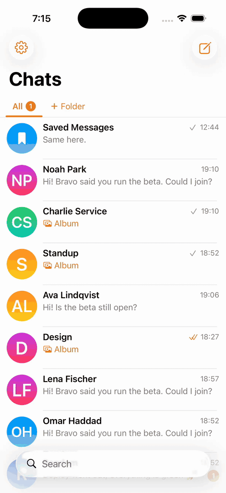
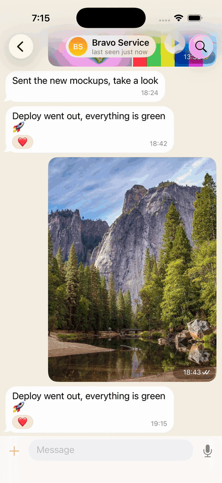
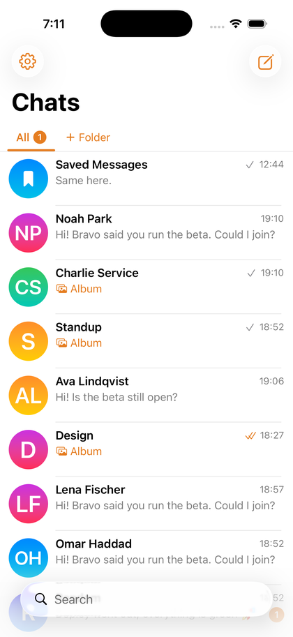
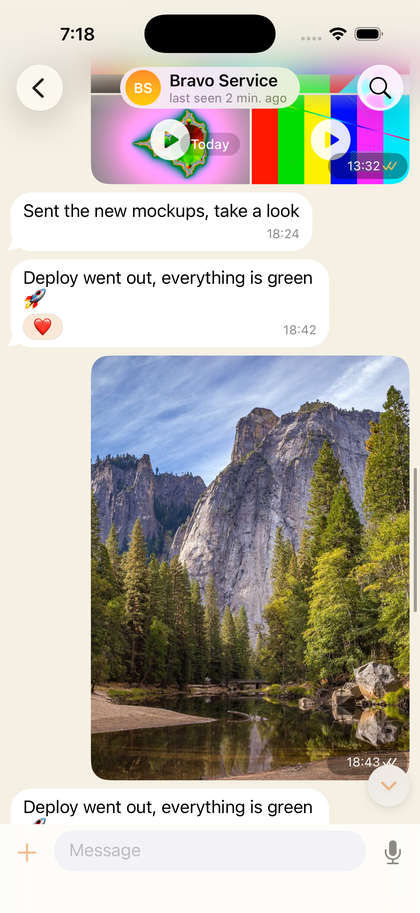
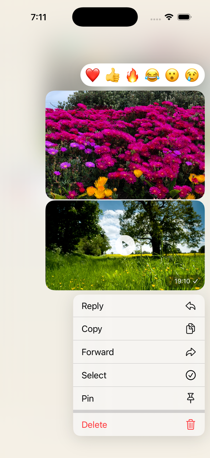
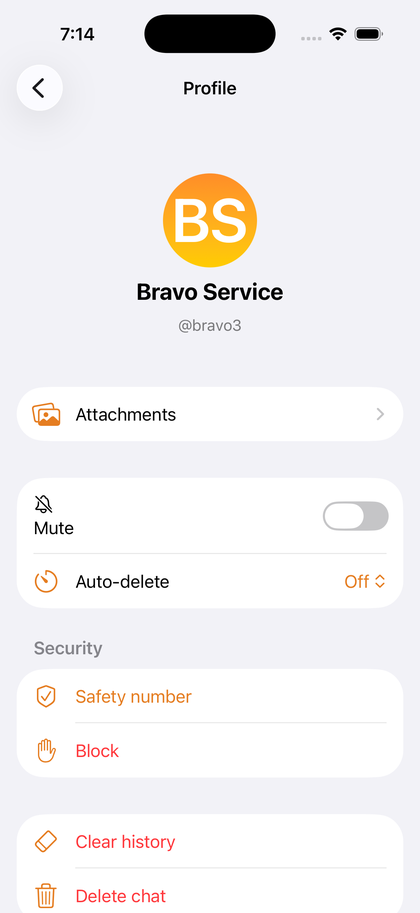
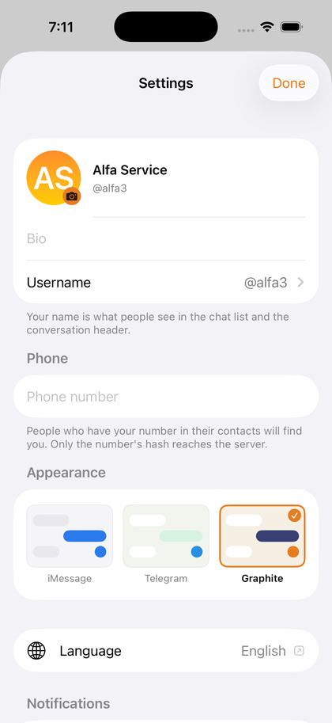
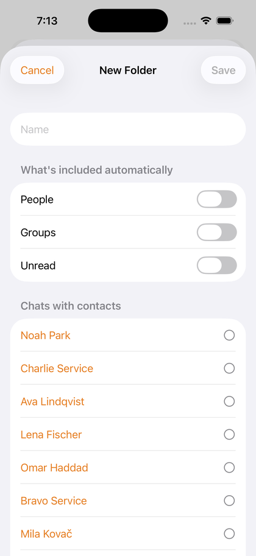

<p align="center">
  
</p>

<h1 align="center">Msngr</h1>

<p align="center">End-to-end encrypted messenger. Swift clients for iOS and macOS, Cloudflare Workers backend.</p>

<table align="center"><tr>
<td></td>
<td></td>
</tr></table>

<p align="center">
  <a href="https://github.com/a-kuz/msngr/raw/main/docs/media/demo.mp4">Full video, 60 fps</a>
</p>

## Features

- Direct and group chats, roles, invite links, message requests
- Text, photos, video, files, voice, albums, replies, forwards, reactions, edits, pins, disappearing messages
- Folders, pinned chats, archive, mute, drafts, search
- X3DH + Double Ratchet, sender keys for groups, encrypted media, safety numbers, PIN with Face ID
- Push notifications decrypted on the device by the extension

No calls.

## Screens

<table align="center"><tr>
<td></td>
<td></td>
<td></td>
</tr><tr>
<td></td>
<td></td>
<td></td>
</tr></table>

## Stack

```
server/                  Cloudflare Worker: hono, WebSocket, Durable Objects, D1, R2, APNs
ios/MsngrKit/            Swift package: MsngrCrypto (X3DH, Double Ratchet, sender keys), MsngrCore (GRDB, sync, E2EE)
ios/Msngr/               iOS app: SwiftUI, UICollectionView feed
ios/MsngrMac/            macOS client on the same core
ios/NotificationService/ push decryption and preview
```

## Run

```bash
cd server && npm install && npx wrangler d1 execute msngr --local --file=schema.sql && npx wrangler dev --port 8787
cd ios && xcodegen && xcodebuild -project Msngr.xcodeproj -scheme Msngr -destination 'id=<simulator UDID>' build
```

Tests: `cd ios/MsngrKit && swift test`, `cd server && node test/smoke.mjs`, `make check`.

## Docs

[Architecture](ARCHITECTURE.md) · [Protocol](docs/protocol.md) · [Crypto flows](docs/crypto-flows.md) · [UI spec](docs/ui-spec.md) · [Process](docs/PROCESS.md)

Demo footage: [Mixkit](https://mixkit.co/license/), photos: [Picsum](https://picsum.photos/).
