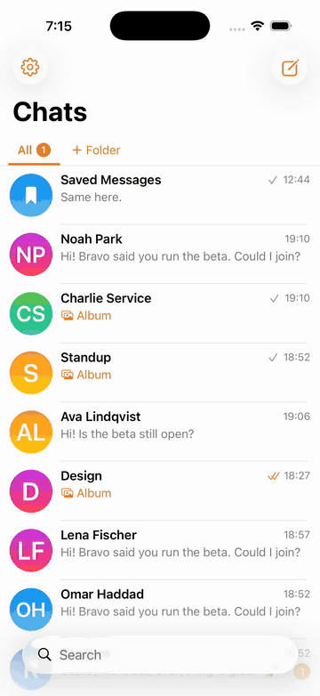

<p align="center">
  
</p>

<h1 align="center">Msngr</h1>

<p align="center">
  An end-to-end encrypted messenger for iOS and macOS<br>
  on a Cloudflare Workers backend.
</p>

<p align="center">
  <a href="#what-it-does">Features</a> ·
  <a href="#screens">Screens</a> ·
  <a href="#how-it-is-built">Architecture</a> ·
  <a href="#running-it">Running it</a> ·
  <a href="#documentation">Documentation</a>
</p>

<p align="center">
  
</p>

<p align="center">
  <sub>Thirty-five seconds on the simulator, one take; the rings mark the touches. The same run at 60 fps: <a href="docs/media/demo.mp4">demo.mp4</a>.</sub>
</p>

## What it does

**Chats.** One-to-one and group chats with roles and invite links. Message
requests: a stranger's first message waits in its own section until you accept
it, and until then they see no receipts, no typing and no presence.

**Messages.** Text, photos, video, files, voice messages, albums, replies,
forwards, reactions, editing, deleting for yourself or for everyone, pinned
messages, disappearing messages. Typing, online and last seen, delivery and read
ticks.

**The list.** Folders built from a rule plus hand-picked chats, pinned chats,
archive, mute, drafts, search over chats and messages, swipe actions on a row.

**Privacy.** Every message is end-to-end encrypted: X3DH and the Double Ratchet
for direct chats, sender keys for groups, encrypted media in R2. Trust on first
use with safety numbers, contact discovery by number hashes, blocking, a PIN
with Face ID. The server stores ciphertext and never sees a key.

**Notifications.** A push carries the encrypted envelope; the Notification
Service Extension decrypts it and writes the message into the shared database,
so the banner shows real text and the chat is already up to date when the app
opens.

There are no calls.

## Screens

<p align="center">
  
  
  
  
  
  
</p>

## How it is built

```
server/                  Cloudflare Worker: HTTP API (hono), WebSocket, Durable Objects, D1, R2, APNs
ios/MsngrKit/            the portable core, a Swift package
  MsngrCrypto            X3DH, Double Ratchet, sender keys, media encryption, safety numbers
  MsngrCore              GRDB store, WS client, SyncEngine, the E2EE pipeline, media, BlurHash
ios/Msngr/               the iOS app: SwiftUI, with the message feed on a UICollectionView
ios/MsngrMac/            a macOS client over the same core
ios/NotificationService/ the NSE: a push preview out of the shared database
```

Two Durable Objects carry the protocol: `UserDO` holds a user's device sockets,
chat list, presence and pushes; `ConversationDO` holds a chat's journal,
membership, `seq` and fan-out. The details are in
[ARCHITECTURE.md](ARCHITECTURE.md).

## Running it

There is no production; this is a development stand.

### Backend

```bash
cd server
npm install
npx wrangler d1 execute msngr --local --file=schema.sql   # once
npx wrangler dev --port 8787
```

The server smoke needs a running `wrangler dev` and covers the API, WS, the
Durable Objects and pushes:

```bash
cd server && node test/smoke.mjs
```

It raises its own push sink on :9871, so the dev APNs mock has to be stopped
first.

### iOS

```bash
cd ios
brew install xcodegen                  # if you do not have it
xcodegen generate                      # .xcodeproj is not in git, it comes from here
xcodebuild -project Msngr.xcodeproj -scheme Msngr \
  -destination 'id=<simulator UDID>' build
```

The server defaults to `http://localhost:8787` and is overridden by the scheme's
`MSNGR_SERVER` environment variable. The simulator reaches the host's localhost
directly.

### Core tests

```bash
cd ios/MsngrKit && swift test          # crypto, sync, offline, migrations, BlurHash, mosaic
```

The app tests (bubble layout, the feed, the unread banner, notification
decisions, registration validation) and the UI smoke go through xcodebuild:

```bash
cd ios
xcodebuild -project Msngr.xcodeproj -scheme Msngr -destination 'id=<UDID>' \
  test -only-testing:MsngrTests
```

The full quality gate is `make check` at the root; see `docs/PROCESS.md`.

### macOS

```bash
cd ios
xcodebuild -project Msngr.xcodeproj -scheme MsngrMac -destination 'platform=macOS' build
open ~/Library/Developer/Xcode/DerivedData/Msngr-*/Build/Products/Debug/MsngrMac.app
```

### Pushes on the dev stand

No Apple account is needed: `APNS_HOST` in `server/.dev.vars` sends pushes to a
mock, which delivers them into the simulator through `simctl`.

```bash
cd server && node tools/apns-mock.mjs --log        # listens on :9871
```

On a simulator the UDID (`SIMULATOR_UDID`) stands in for the APNs token. The
channel has a limit: `simctl push` does not start the Notification Service
Extension, as `docs/research/nse-simulator-experiment.md` shows.

### Deploying the backend

```bash
npx wrangler d1 create msngr           # database_id → wrangler.jsonc
npx wrangler r2 bucket create msngr-media
npx wrangler d1 execute msngr --remote --file=server/schema.sql
npx wrangler secret put APNS_KEY_P8    # contents of the .p8
npx wrangler secret put APNS_KEY_ID
npx wrangler secret put APNS_TEAM_ID
npx wrangler secret put APNS_TOPIC     # the app's bundle id
npx wrangler deploy
```

## Documentation

- `CLAUDE.md` — the rules for agents working in this repository.
- `ARCHITECTURE.md` — components and principles.
- `docs/protocol.md` — the HTTP and WS protocol, the E2E envelope, pushes.
- `docs/crypto-flows.md` — first contact, TOFU, groups, contact discovery.
- `docs/ui-spec.md` — how the client behaves: the feed, the bubble, animations,
  palettes.
- `docs/PROCESS.md` — the quality gate, the state matrix, the stands.
- `docs/audits/`, `docs/qa/`, `docs/research/` — audits, runs, research.

The demo above is scripted: `scripts/fixture.py` puts a service account on a
simulator, `msngrfixture send` and `msngrfixture knock` play the other side,
and `xcrun simctl io recordVideo` records the screen. The stock footage in the
album is from [Mixkit](https://mixkit.co/license/) and the photos from
[Picsum](https://picsum.photos/).
