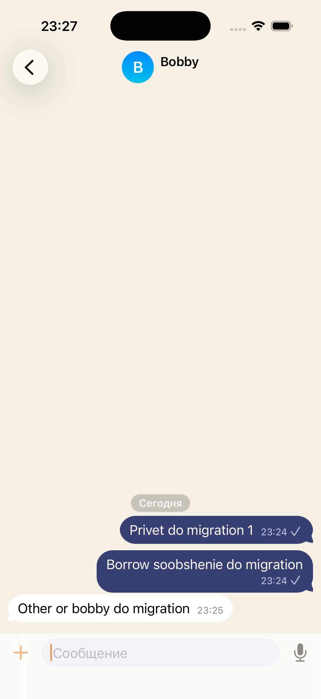
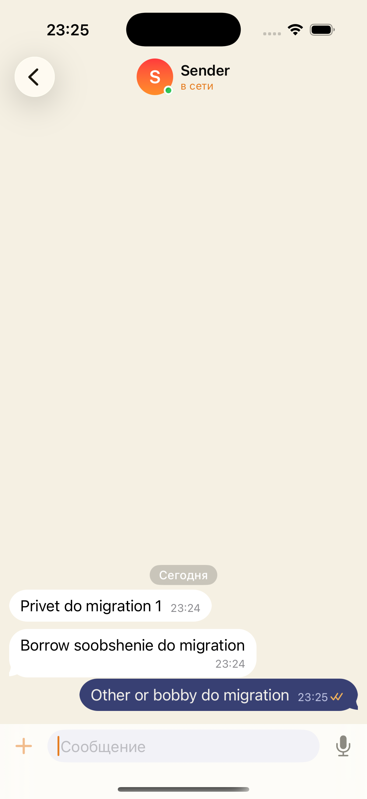
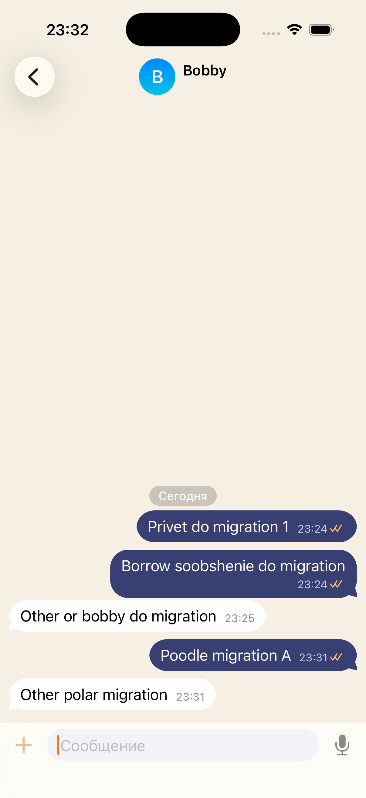
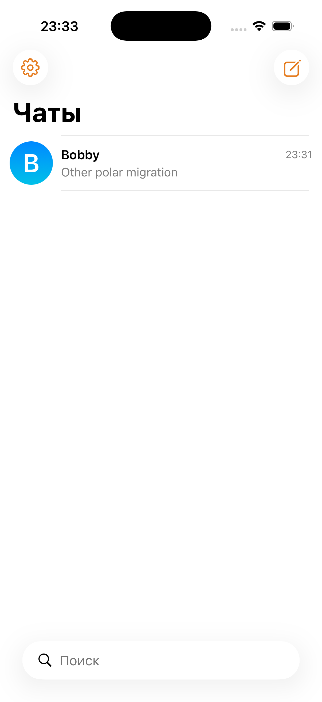

# Переезд хранилища в контейнер app group: живой апгрейд

Дата: 2026-08-14. Стенд агента: симуляторы `appgroup-a` (CC413289, юзер
`agsender`) и `appgroup-b` (08DE4A49, юзер `bobby11`), собственный
`wrangler dev` на :8793 с отдельным `--persist-to`. Симуляторы удалены после
прогона.

## Что проверялось

Установленная сборка без entitlement хранит БД и `.masterkey` в Application
Support. Сборка с entitlement считает путями контейнер группы. Апгрейд поверх
установленной сборки не должен выглядеть как чистая установка: аккаунт,
история и ratchet-сессии обязаны пережить переезд.

## До миграции

Сборка из коммита 4234a3d (entitlement ещё нет). Зарегистрированы два юзера,
чат с тремя сообщениями в обе стороны — расшифровка работает, галочки
прочтения приходят.




Раскладка файлов (Application Support приложения):

```
.masterkey  media-outgoing/  msngr.sqlite  msngr.sqlite-shm  msngr.sqlite-wal  session.json
$ xcrun simctl get_app_container CC413289… ai.enface.Msngr groups
(пусто)
```

## Апгрейд

`xcrun simctl install` поверх, без удаления приложения. Контейнер группы
создаётся installd в момент установки:

```
group.ai.enface.msngr  …/data/Containers/Shared/AppGroup/A4E4C3AC-…
```

После первого запуска новой сборки:

```
группа:            .masterkey  avatars/  media-outgoing/  msngr.sqlite  msngr.sqlite-shm  msngr.sqlite-wal
Application Support: session.json
```

`.masterkey` в группе — тот же файл (32 байта, mtime 23:19 сохранён при
переносе), БД содержит все сообщения.

## После миграции

Тот же аккаунт (`agsender`, userId `01M00YWEK31T9S6DAS3H7PPWF4`), история на
месте. Обмен новыми сообщениями в обе стороны: `Posle migracii A` уходит и
расшифровывается у bobby11, ответ приходит и расшифровывается у agsender.
Значит ratchet-состояния и identity пережили переезд — при смене мастер-ключа
или identity расшифровка сломалась бы.



Повторный запуск ничего не переносит заново, список чатов не меняется:



## Тесты

- `swift test` в MsngrKit: 53 теста, из них 8 на перенос хранилища.
- MsngrTests на симуляторе агента: 48 тестов.
- Сборка Msngr под симулятор: BUILD SUCCEEDED.
- `scripts/collect-crashes.sh --since 60`: крашей нет.

## Что осталось непроверенным

Класс защиты файлов (`completeUntilFirstUserAuthentication`) на симуляторе не
проверить: Data Protection там не реализована, так что ни факт применения
атрибута, ни доступ к БД при заблокированном экране на симуляторе не
воспроизводятся. Проверять на устройстве.
