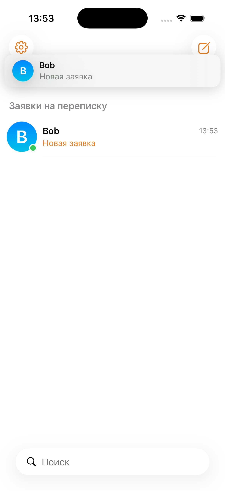
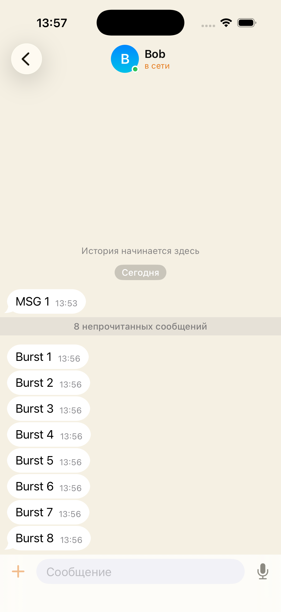
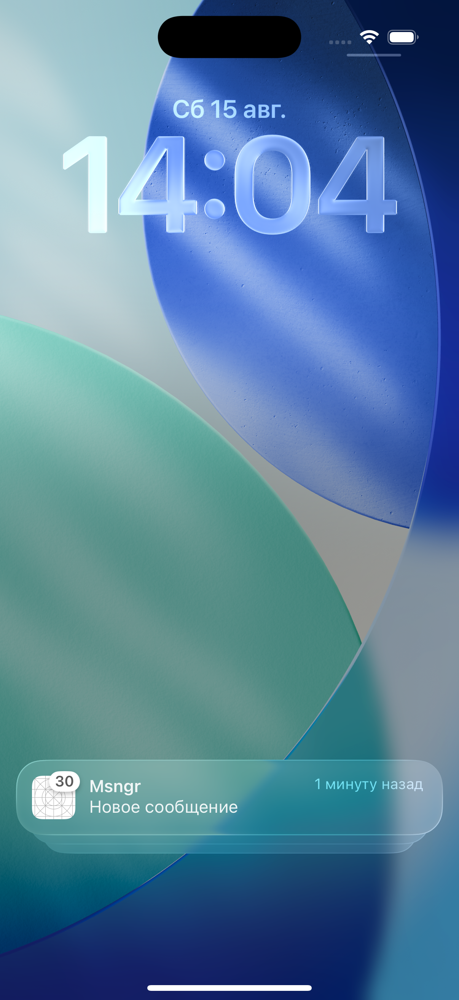

# Push burst: order, one banner per message, what the system does to a burst

Date: 2026-08-15. Agent stand: simulators `msngr-a62` (7BA44388, user `alice62`)
and `msngr-a62-b` (01577EB8, user `bob62`), own `wrangler dev` on :8830 with a
separate `--persist-to`, no APNs mock. Both simulators deleted after the run.

## What the burst ordering rests on

The banner order in the notification centre is the delivery order, newest on
top. Measured directly: 40 pushes were handed to the simulator one after
another, and the expanded stack listed them 40, 39, 38, 37, 36, 35, 34, 33 from
the top. The same on the next wave: 120, 119, ... So controlling the order in
which the extension answers its pushes controls what the user sees, which is
what the coalescing window is for.

## How many notifications the system keeps

120 pushes to one thread-id, delivered over 17 seconds (~7 per second). The
notification centre kept **100** of them and dropped the 20 oldest: the stack
header says "100 уведомлений", and scrolling the expanded stack yields the
contiguous range 21...120 with no holes inside. No summary banner appeared, no
"you have N new notifications" text.

So above a hundred notifications the oldest ones are evicted no matter what the
app does, and reposting anything only costs a live notification its place.

## The extension does not run on the simulator

30 pushes were delivered to the app in the background. The extension writes a
line into `nse-journal.log` in the app group on every entry into `didReceive`,
on every answer and on expiry; after the burst the file did not exist at all,
while the icon badge went to 30 — the pushes were delivered and shown with the
payload they arrived with.

Measured invocations: **0 of 30**. This matches `docs/research/nse-simulator-experiment.md`:
`simctl push` never starts a Notification Service Extension, in any app state,
and a control extension without dependencies behaves the same. The ceiling on
how many pushes of a burst iOS is willing to service can therefore only be
measured on hardware; the journal is the instrument for it.

## One banner per message still works

A message claims its notification in the database before the banner goes out,
and the extension takes the same claim, so a push about a message the app has
already announced produces nothing. The claim sits in the app's own path now,
so the run checked that banners did not disappear with it: Bob wrote to Alice,
and the in-app banner came up as before.

## A burst lands in the database even without banners

Alice's app was sent to the background, Bob sent eight messages in a row. No
banner appeared: the socket is suspended in the background, the simulator gets
no APNs, and the extension does not run there. Alice reopened the app — all
eight messages were in the chat, in order, with the unread counter at 8.

Grouping by chat: a burst to one thread-id is one stack in the centre, opened
by a tap.

## Not covered here

The ordering itself, end to end: it lives in the extension, and the extension
does not run on the simulator. What is covered by units is the whole decision —
the window, the seq order, the deduplication, the read mark, the holes
(`NotificationBurstTests`, `NotificationBurstGateTests`, `NotificationBurstStoreTests`).
On a device the same run has to answer two more questions: how many pushes of a
burst enter `didReceive` at all, and whether the answers leave in the planned
order. Both are read off `nse-journal.log`.
