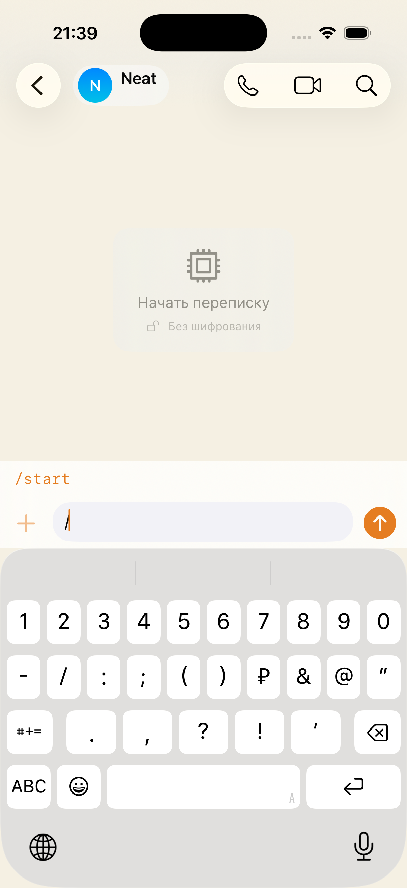
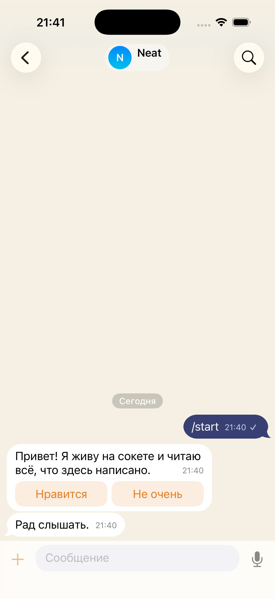

# Bots, live — 2026-09-01

One simulator (`fable-a`, account `fablechana`) against the shared stand, and a
bot answering from `server/tools/demo-bot.mjs` — a socket, a token, and
plaintext content, which is the whole of the bot API.

## What was watched

1. **Making one.** Settings → «Мои боты» → «New bot»: a username, a name and a
   command list. The screen says what a bot costs before the first one exists:
   a bot has no keys, so a chat with it is not encrypted.
2. **The token.** Shown once, on the screen that made the bot, with the line
   that says the server keeps only its hash. `demo-bot.mjs` connected with it.
3. **Finding it.** The global search finds the bot by its username like a
   person; opening it opens an ordinary direct chat.
4. **The promise, the other way round.** The empty chat reads «Без шифрования»
   under «Начать переписку», and the header offers no call — a bot has no
   device to ring.
5. **Commands.** Typing «/» offered `/start` from the list the owner published.
6. **The answer and its buttons.** The bot replied with two buttons drawn
   inside its bubble.
7. **A press.** «Нравится» sent a `callback` and left no line in the feed; the
   bot's log shows `<- callback y` and its answer «Рад слышать.» arrived.

## Found on the way

- **A defect, logged and fixed:** the date separator read the sender's clock
  while the time inside the bubble reads the server's. A bot stamping `sentAt`
  in milliseconds produced «1 августа 58638» above a message whose own time
  said 21:35. The separator now follows the same rule as the bubble;
  `docs/qa/defects.md` keeps what is still open (ordering leans on `sentAt`).
- A bot hears its own messages back, the way a second device would. Every bot
  has to know its own id and skip them, or the first answer it sends comes
  straight back and it answers itself forever — which is exactly what happened
  on the first try. `demo-bot.mjs` reads `/api/me` at startup and says so in a
  comment.

## Not covered here

- A bot in a group was watched on the server (smoke) and not on two devices.
- A reply keyboard — buttons in place of the keyboard — is not built.
