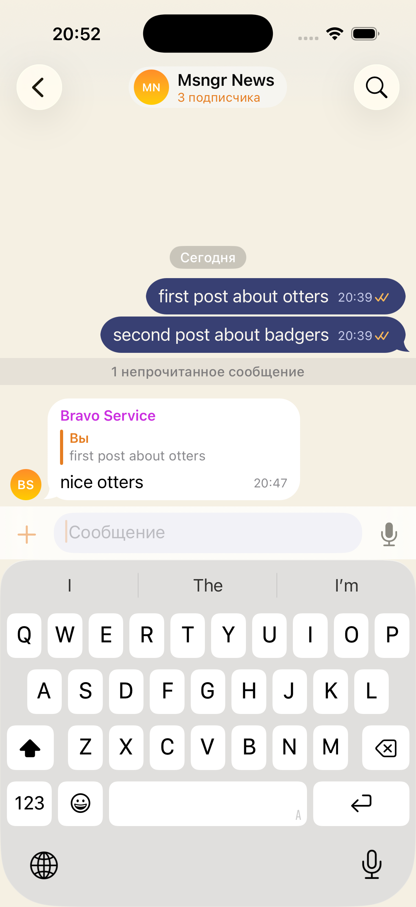
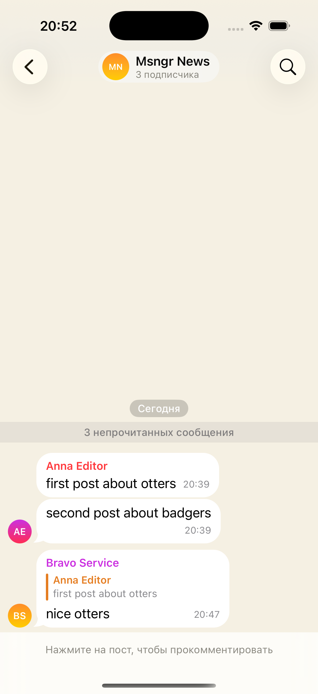

# Channels, live on two simulators — 2026-09-01

Two simulators against the shared stand: `fable-a` as the owner (`fablechana`,
Anna Editor), `fable-b` as the subscriber (`fablechanb`, Boris Reader).

## What was watched

1. **Creating one.** New chat → «Новый канал» → the name field, and under it
   the sentence that says what a channel costs: «Канал не шифруется: посты
   лежат на сервере открытым текстом, и любой, кто подпишется позже, прочитает
   всю историю». Created with the owner alone.
2. **Posting.** Two posts from the owner (`first post about otters`, `second
   post about badgers`). They leave as `plain` envelopes: nothing is encrypted
   on this path, which is the whole point of the kind.
3. **The card.** Chat info reads «Канал», «1 подписчик», repeats the plaintext
   sentence, and lists the owner with the role «владелец». There is no
   «Отписаться» for an owner.
4. **The link.** «Ссылка-приглашение» minted `msngr://join/V0smlI-PU4zu` and
   put it on the clipboard.
5. **Subscribing.** The link opened on `fable-b` joined the channel and landed
   in it. Both posts were there — the subscriber arrived after they were
   written and still reads them (screenshot below).
6. **A subscriber cannot post.** In place of the composer the screen says
   «Нажмите на пост, чтобы прокомментировать».
7. **Commenting.** A long press on the post offers «Прокомментировать» instead
   of «Ответить»; the composer opens on that post and the comment goes out as
   `comment`. The owner sees it quoting the post it answers.
8. **Search.** The magnifier in the channel's header, `badgers` — one hit. The
   stand's log for the same second:
   `GET /api/chats/01M1F0RMXBVM1KGSP50P9Q7J0S/search 200 OK (5ms)`, so the
   answer came from the server's copy of the journal, not from this device's
   database.

## Found and fixed on the way

- `msngr://join/<code>` was minted, put in a message and never handled: the app
  had no URL handler at all, so an invite link opened nothing — in a group as
  much as in a channel. `App/InviteLink.swift` + `onOpenURL` in `MsngrApp`.
- The empty channel showed «Сквозное шифрование» under «Начать переписку». It
  now reads «Напишите первый пост» and «Без шифрования».
- The description field of a channel offered «О чём эта группа».

## Not covered here

- Channel media: the path is the ordinary one and was not exercised in this run.
- Two devices of one account in the same channel.
