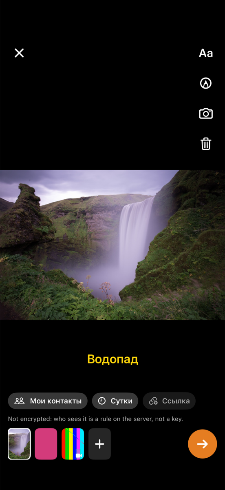
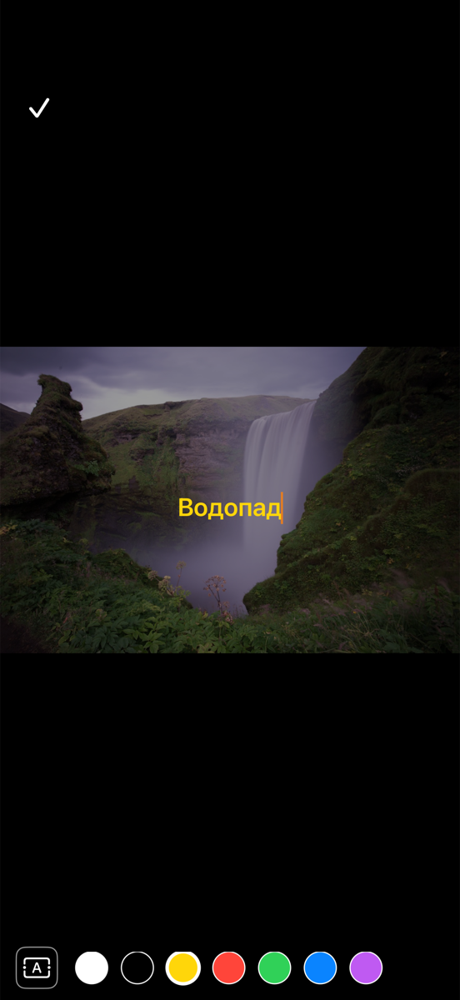
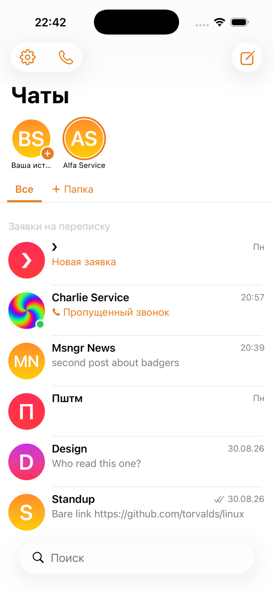
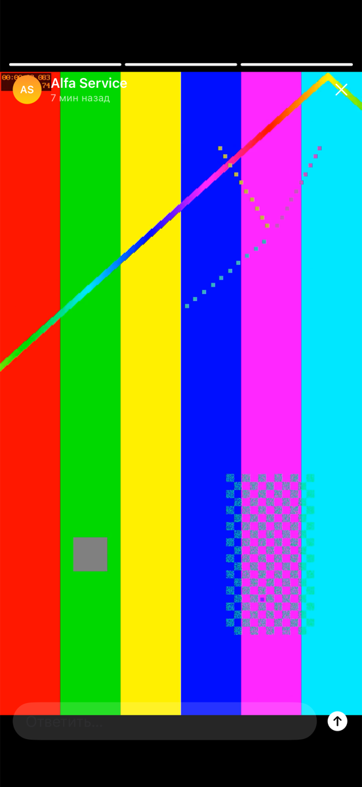
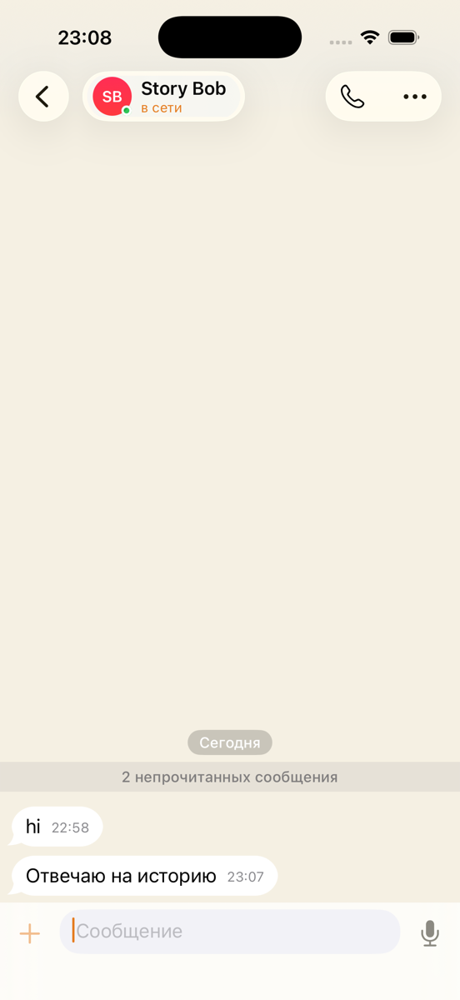

# Stories, live — 2026-09-01

Two simulators against the shared stand: `fable-a` as `alfa`, `fable-b` as
`bravo` for the composer and the viewer; then two throwaway accounts
(`fablesa`, `fablesb`) for the reply, because bravo's home was in another
agent's hands at the time and a message from it would have forked the ratchet.
The library on `fable-a` held two pictures and a four-second clip put there
with `simctl addmedia`.

## What was watched

1. **The tray.** The chat list opens with the stories row over the folder bar:
   «Ваша история» with a plus, then everyone with something live. Nobody had
   anything yet, so the row held one cell.
2. **The composer.** The plus opens the library straight away. Three items
   picked in order (a waterfall, a pink frame, the clip) came in as three
   frames; the last one filled the screen with the tools laid over it and the
   filmstrip along the bottom. The clip shows its poster with a play glyph, and
   the markup tool is offered on pictures only.
3. **Text on the frame.** «Aa» put the field on the picture, the colour strip
   and the plate switch above the keyboard. «Водопад» typed, yellow picked, the
   plate cycled to none; a drag moved the label down the frame, and the
   published story carried `ty ≈ 0.73` for it.
4. **Publishing.** The chips read «Мои контакты · Сутки · Ссылка»; the link
   chip was turned on, the note under them changed to say the story opens in
   any browser without an account. The round button published; the ring
   appeared around the own avatar in the tray.
5. **The viewer, the other side.** Bravo's tray showed «Alfa Service» with a
   full ring within the minute. Taps walked the three frames, the text stood
   where it was dragged, the clip played with the progress bar running its
   four seconds, and the ring went faint afterwards.
6. **Who watched.** Alfa's own story opens from its tray cell; the ellipsis
   offers «Кто посмотрел», «Скопировать ссылку», «Отозвать ссылку», «Снять
   историю», and the clock stands while the dialog is open. The list held
   Bravo Service alone.
7. **The page outside.** The minted link answered 200 over https with three
   figures, the caption at `left:50%;top:73%`, and the clip served as
   `video/mp4`. After «Снять историю» the API list was empty for the author,
   the ring was gone from the tray and the frame behind the link answered 404.
8. **Answering.** `fablesb` opened `fablesa`'s story, typed a reply in the
   field at the bottom (the clock stands while it has focus), and sent it. The
   text arrived in the direct chat on the other simulator.

## Found on the way

- **Fixed in the run:** the author's own look at their story counted as a
  view. The server now drops the author's `seen`, and the client does not
  send it; the smoke test covers it.
- **Fixed in the run:** the minted link began with `http://` because the
  worker behind the tunnel sees plain http. The origin now follows
  `x-forwarded-proto`.
- **Fixed in the run:** the simulator says a camera source is available and
  then crashes the picker for the lack of a device. The camera button is drawn
  only when a capture device exists and it can shoot a clip. Shooting itself
  was not exercised: no simulator has a camera.
- **Fixed in the run:** a single five-second frame closed the viewer under a
  reply that was being typed; the clock now waits for the field.
- The library picker on a fresh simulator sits on «Загрузка…» for ten to
  twenty seconds the first time it opens after `addmedia`. That is Photos
  indexing on the simulator, not the app.
