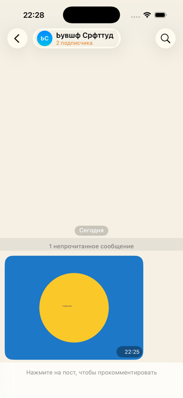

# Channel media, live on two simulators — 2026-09-02

Two simulators against the shared stand: `bravo` on the gate runner as the
owner, `charlie` on `fable-charlie` as the subscriber who arrives after the
post is written. The 2026-09-01 channel run left this path unexercised.

## What was watched

1. **Posting a photo.** New chat → «Новый канал», a photo from the library
   through the attachment sheet, sent as the first post. The stand's log for
   that second: `POST /api/media 200 OK (6ms)`, then the post itself.
2. **What the server holds.** The post in the channel's ConversationDO journal
   is a `mode: plain` envelope with `kind: photo` and the media descriptor in
   the clear: `mediaId 01M1HSA2YCW08GE37MEQ5P529G`, `key`, `hash`, `blurhash`,
   `w`/`h`, `mime image/jpeg`. The server can hand the blob and its key to
   anyone it lets into the channel, and could read the picture itself — the
   cost the channel card states.
3. **A late subscriber.** «Ссылка-приглашение» minted
   `msngr://join/3Wujk539wcIu`; opened on `charlie` it joined
   (`POST /api/join/… 200`), listed the chats and immediately fetched the
   blob (`GET /api/media/01M1HSA2YCW08GE37MEQ5P529G 200 OK (3ms)`). The
   channel opened on the photo, decrypted with the key from the readable
   body, under «1 непрочитанное сообщение» and «2 подписчика» in the header.

## Not covered here

- Video in a channel: the descriptor is the same shape; the blocks path was
  watched in a direct chat on 2026-09-02 (run-streaming), not in a channel.
- Serving channel media through CF Stream / Images: there is no binding for
  either on the stand or in `wrangler.jsonc`.
