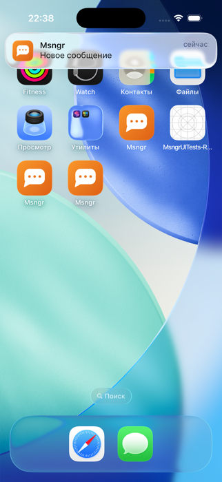

# The missed-call push, live on two simulators — 2026-09-02

`charlie` on `fable-charlie` dials `bravo` on the gate runner while bravo's app
is killed, then hangs up before an answer. The caller alone writes the call
into the feed (`CallManager.publishLog`: cancel → `missed`), and that record
rides `service` + `notify`, so it is the one call frame that pushes.

## What was watched

1. **First take.** The relay accepted the push (`apns-relay: … → 200`); the
   extension on bravo received seq 9 of the direct chat, stored it and
   answered `show` (`nse-journal.log`), and the row is
   `kind=call`, `{"outcome":"missed"}`. SpringBoard presented the banner for
   its default seven seconds (the platter registered at 22:31:32.077 and
   unregistered at 22:31:39.557) but it did not stay in Notification Center:
   at 22:31:31 another session installed a build on the shared gate runner
   («Applications were replaced», a test host under xctest) and the reinstall
   cleared every delivered notification of the bundle
   («Remove all delivered notifications» in the UserNotifications log). Not a
   product fault; the run was redone.
2. **Second take.** The banner is on the screen (below), the extension answered
   `show` for seq 13 — but with the generic «Новое сообщение», because the
   envelope came back `deferred`: `no_session` for charlie's device. The row
   sat in `pendingDecrypt`, and the moment bravo's app opened it became the
   `missed` call row. So the push reaches a killed app and the message is not
   lost, but the banner text depended on a session the extension could not
   use. Why it could not is the defect below.

## Found on the way

The two homes have been rebuilding their pairwise session every minute since
21:34 in both directions: prekey handshakes at seqs 1, 10, 11, 14, 16, 17,
19, 23 of the direct chat and 13, 18, 20–26, 29 of the group, nine and
fifteen bundle fetches for bravo's and charlie's prekeys in eighty minutes,
bravo's one-time prekeys on the server down from 24 to 14. Two of charlie's
handshakes sit on bravo as `pk_decrypt_failed`, four other frames as
`no_session` with over a hundred replays each; charlie holds one of bravo's.
Neither outbox is blocked and no identity change is pending, and the
server's identity sign keys match what each home trusts. The entry is in
`docs/qa/defects.md` («A repair storm between two fresh homes»).

## Not covered here

- The ring with the app closed: that is the VoIP push, blocked on the device
  signing certificate.
